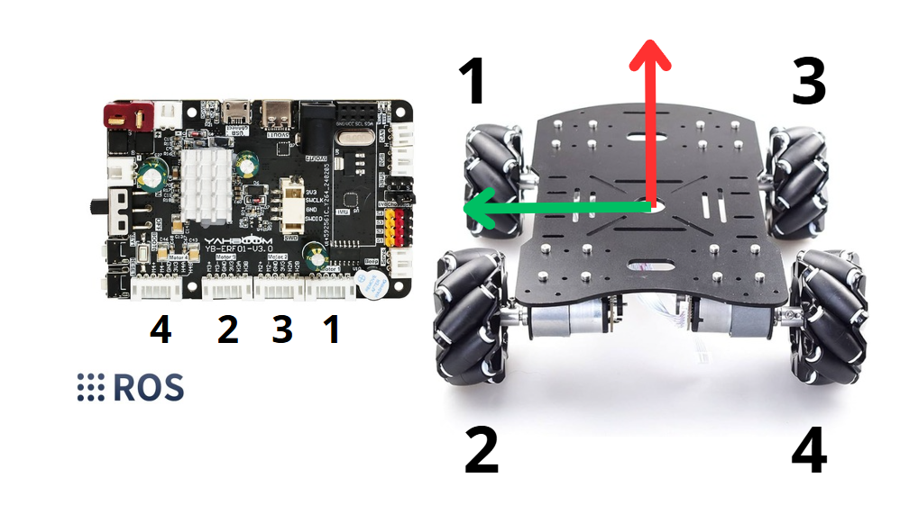

# **Pascalito_EIA**

Bienvenido al repositorio de **Pascalito**, un robot móvil desarrollado con ROS 2 Jazzy Jalisco que utiliza una Raspberry Pi 5 y hardware adicional para navegación, mapeo y control.

## **Componentes del Robot**
Pascalito está construido con los siguientes componentes de hardware:

- **LiDAR**: RPLIDAR A1
- **Computadora principal**: Raspberry Pi 5
- **Controlador**: Yahboom ROS Robot Control Board V1.0
- **Actuadores**: 4 motores DC JGB37-520 con encoders integrados

---
## **Clonar el Paquete del LiDAR**

El paquete utilizado para controlar el LiDAR es **`rplidar_ros`**. Para usarlo en este proyecto, clona el repositorio oficial en tu workspace de ROS 2.

### **Comando para clonar:**
```bash
git clone https://github.com/Slamtec/rplidar_ros.git
```
---
## **Estructura del Proyecto**

Este repositorio contiene:

- **Paquete principal (`pascalito`)**: 
  Contiene los nodos y configuraciones principales para el **mapeo** y **navegación**.

- **Paquete de control de motores (`motor_control_pkg`)**: 
  Controla los motores y el LiDAR.

- **Configuraciones de SLAM y navegación**:
  - Archivos de parámetros para **SLAM Toolbox** y **Navigation2**.
  - Archivos de lanzamiento para diferentes funcionalidades del robot.

## **Cómo ejecutar Pascalito desde centro de control**

### **1. Mapeo del entorno**
Para iniciar el mapeo desde la estación de control:
```bash
ros2 launch pascalito pascalito_mapeo.py
```

### **2. Navegación con Nav2**
Para iniciar el sistema de navegación:
```bash
ros2 launch pascalito pascalito_navegante.py
```
### **3. Control para teleoperación (Opcional)**
Para iniciar el sistema de navegación:
```bash
ros2 run yahboomcar_ctrl yahboom_keyboard
```
---

## **Configuración en la Raspberry Pi 5**

### **1. Control de motores y LiDAR**
Para iniciar el mapeo desde la estación de control:
```bash
ros2 launch motor_control_pkg pascalito_bringup.py
```

### **2. Control del LiDAR por separado**
Para iniciar el sistema de navegación:
```bash
ros2 launch rplidar_ros rplidar_a1_launch.py
```
---

## **Conexión de los motores a la placa Yahboom**



---

## **Notas**

Si vas a utilizar la navegación recuerda que no debes estar ejecutando el **`yahboom_keyboard`**, dado que este manda comandos a /cmd_vel en 0 cuando no estas presionando las teclas


